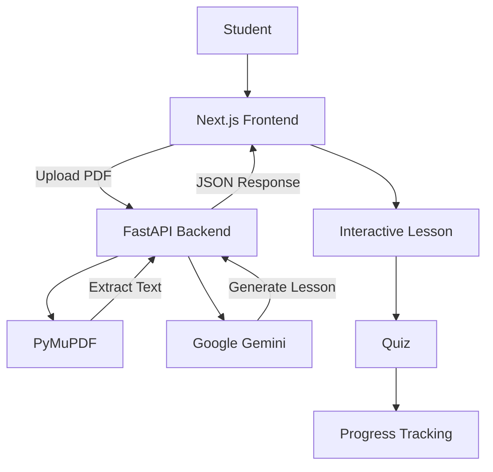
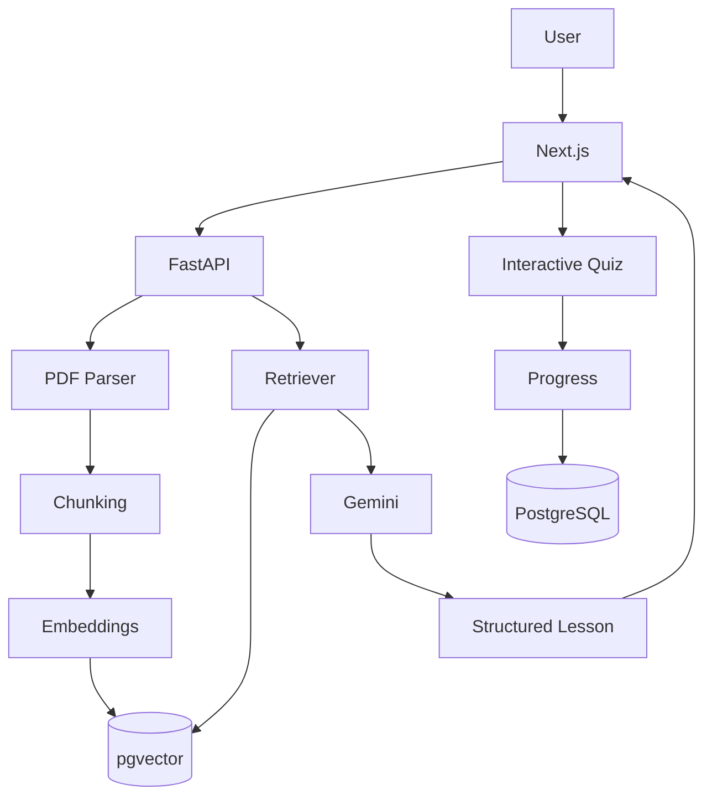

# 🎓 AI Tutor

> **Turn study material into an interactive learning experience.**

AI Tutor is a full-stack learning application that takes a **PDF**, extracts its content, sends it to **Google Gemini**, and transforms the material into an AI-generated lesson.

The long-term goal is to go beyond summarization and create a tutor that can **explain, teach, quiz, adapt, and track learning progress**.

<p align="center">
  
  
  
  
  
  
</p>

---

## 📌 Table of Contents

- [✨ Features](#-features)
- [🎯 Project Goal](#-project-goal)
- [🏗️ Architecture](#️-architecture)
- [🧠 Current Pipeline](#-current-pipeline)
- [🛠️ Tech Stack](#️-tech-stack)
- [📁 Project Structure](#-project-structure)
- [⚡ Quick Start](#-quick-start)
- [🔑 Environment Variables](#-environment-variables)
- [🔌 API](#-api)
- [🖥️ Usage](#️-usage)
- [🧪 Development Workflow](#-development-workflow)
- [🗺️ Roadmap](#️-roadmap)
- [🔒 Security Notes](#-security-notes)
- [🤝 Contributing](#-contributing)
- [📄 License](#-license)

---

## ✨ Features

### Current

- 📄 PDF upload
- ⚡ FastAPI backend
- 🔍 PDF text extraction with PyMuPDF
- 🤖 Gemini-powered lesson generation
- 🔄 Next.js ↔ FastAPI communication
- 📝 Markdown-rendered AI lessons
- 🌐 CORS configuration for local development

### Planned

- 🧩 Structured lesson sections
- ❓ Interactive quizzes
- 📊 Score and progress tracking
- 💬 Ask-the-tutor conversations
- 🧠 Context-aware answers from uploaded material
- 👤 Authentication
- 💾 Saved lessons
- 🗄️ Database and vector search
- 🎙️ Voice interaction
- 🎨 Rich visual explanations

> [!NOTE]
> **PDF is currently the supported document format.** Additional formats can be added later after the core PDF → lesson pipeline is stable.

---

## 🎯 Project Goal

The application is being developed around one core learning loop:

```text
Upload Study Material
        ↓
Extract Content
        ↓
Understand the Material
        ↓
Generate Structured Lesson
        ↓
Learn
        ↓
Practice
        ↓
Ask Questions
        ↓
Track Progress
```

The final product should feel like a **personal AI tutor**, not just a PDF summarizer.

---

## 🏗️ Architecture



### Component Responsibilities

| Component | Responsibility |
|---|---|
| **Next.js** | User interface and client-side interaction |
| **React** | UI components and application state |
| **TypeScript** | Type safety |
| **Tailwind CSS** | Styling |
| **FastAPI** | Backend API |
| **PyMuPDF** | PDF text extraction |
| **Gemini** | Lesson generation and future tutoring |
| **Uvicorn** | ASGI development server |

---

## 🧠 Current Pipeline

The current implementation follows:

```text
PDF
 ↓
Browser
 ↓
POST /upload
 ↓
FastAPI
 ↓
PyMuPDF
 ↓
Extracted Text
 ↓
Gemini
 ↓
Generated Lesson
 ↓
FastAPI Response
 ↓
Next.js
 ↓
Rendered Lesson
```

### Current API response concept

```json
{
  "filename": "example.pdf",
  "text": "Extracted PDF text...",
  "lesson": "AI-generated lesson..."
}
```

> [!IMPORTANT]
> The next architectural improvement is to replace the large Markdown lesson with **structured JSON** containing fields such as `title`, `summary`, `concepts`, `examples`, and `quiz`.

---

## 🛠️ Tech Stack

### Frontend

- Next.js
- React
- TypeScript
- Tailwind CSS
- React Markdown

### Backend

- Python
- FastAPI
- Uvicorn
- PyMuPDF
- python-multipart

### AI

- Google Gemini API
- `google-genai` Python SDK

### Planned

- PostgreSQL / Supabase
- pgvector
- Authentication
- RAG
- Vercel
- Railway / Render
- CI/CD
- Automated testing

---

## 📁 Project Structure

```text
ai_tutor/
│
├── app/
│   ├── page.tsx
│   ├── layout.tsx
│   └── globals.css
│
├── backend/
│   ├── main.py
│   ├── requirements.txt
│   └── venv/
│
├── public/
│
├── .gitignore
├── package.json
├── package-lock.json
├── next.config.ts
├── tsconfig.json
├── README.md
├── TODO.md
└── LEARNING.md
```

> [!WARNING]
> `backend/venv/` should **never** be committed to Git. It is a local Python virtual environment.

---

# ⚡ Quick Start

## Prerequisites

Make sure you have:

- Node.js
- npm
- Python 3.9+
- A Google Gemini API key
- Git

---

## 1. Clone the repository

```bash
git clone <YOUR_GITHUB_REPOSITORY_URL>
cd ai_tutor
```

---

## 2. Start the frontend

From the project root:

```bash
npm install
npm run dev
```

Open:

```text
http://localhost:3000
```

---

## 3. Set up the backend

Open a second terminal:

```bash
cd backend
```

Create the virtual environment:

```bash
python3 -m venv venv
```

Activate it on macOS/Linux:

```bash
source venv/bin/activate
```

Install dependencies:

```bash
python -m pip install fastapi uvicorn python-multipart PyMuPDF google-genai
```

Start FastAPI:

```bash
uvicorn main:app --reload
```

Backend:

```text
http://127.0.0.1:8000
```

Interactive API documentation:

```text
http://127.0.0.1:8000/docs
```

> [!TIP]
> If `uvicorn` is not found, activate the virtual environment first:
>
> ```bash
> source venv/bin/activate
> ```
>
> Or run it directly:
>
> ```bash
> ./venv/bin/uvicorn main:app --reload
> ```

---

# 🔑 Environment Variables

Never hard-code API keys inside Python or TypeScript files.

Create:

```text
backend/.env
```

Example:

```env
GEMINI_API_KEY=your_api_key_here
```

Add `.env` to `.gitignore`:

```gitignore
.env
*.env
```

> [!CAUTION]
> **Never commit your Gemini API key to GitHub.**
>
> If a secret is accidentally committed, rotate/revoke it immediately.

---

# 🔌 API

## Health Check

### `GET /`

Checks whether the FastAPI backend is running.

Example:

```json
{
  "message": "AI Tutor backend is running"
}
```

---

## Upload PDF

### `POST /upload`

Accepts a PDF using `multipart/form-data`.

Example:

```bash
curl -X POST \
  http://127.0.0.1:8000/upload \
  -F "file=@example.pdf"
```

Current processing:

```text
Receive PDF
    ↓
Read file bytes
    ↓
Open with PyMuPDF
    ↓
Extract text page-by-page
    ↓
Send content to Gemini
    ↓
Return lesson
```

---

## API Documentation

FastAPI automatically provides interactive documentation during development:

```text
http://127.0.0.1:8000/docs
```

This is useful for testing endpoints independently from the frontend.

---

# 🖥️ Usage

1. Start the FastAPI backend.
2. Start the Next.js frontend.
3. Open `http://localhost:3000`.
4. Select a PDF.
5. Click **Upload**.
6. The PDF is sent to FastAPI.
7. PyMuPDF extracts the text.
8. Gemini generates the lesson.
9. The lesson is displayed in the browser.

### Example UI Flow

<table>
  <tr>
    <td align="center">
      <b>1. Upload</b><br />
      
    </td>
    <td align="center">
      <b>2. Learn</b><br />
      
    </td>
  </tr>
</table>

> [!NOTE]
> The screenshot paths above are placeholders. Add your own screenshots under `docs/screenshots/` when the UI is ready.

---

# 🧪 Development Workflow

This project is also being used to learn full-stack development through building.

The preferred workflow is:

```text
Understand
    ↓
Plan
    ↓
Attempt
    ↓
Build
    ↓
Test
    ↓
Debug
    ↓
Understand the solution
    ↓
Refactor
    ↓
Commit
```

### Before asking AI for code

Try to answer:

1. What am I trying to build?
2. What data goes in?
3. What should come out?
4. Which component should handle it?
5. What do I already know?

### After getting help

Do not stop at "it works".

Use:

```text
Predict → Run → Explain → Modify → Rebuild
```

The goal is to become capable of building the next feature independently.

---

# 🌿 Git Workflow

Check the current state:

```bash
git status
```

Review changes:

```bash
git diff
```

Stage changes:

```bash
git add .
```

Commit:

```bash
git commit -m "feat: add PDF text extraction"
```

Push:

```bash
git push
```

View history:

```bash
git log --oneline
```

### Commit convention

Use small, meaningful commits:

```text
feat: add PDF upload
feat: extract PDF text
feat: integrate Gemini
feat: render AI lesson
fix: handle upload errors
refactor: separate lesson components
ui: improve lesson layout
docs: update setup instructions
```

---

# 🗺️ Roadmap

## Phase 1 — Core Pipeline

- [x] Next.js application
- [x] FastAPI backend
- [x] PDF upload
- [x] PDF text extraction
- [x] Gemini integration
- [x] Display generated lesson

## Phase 2 — Structured Learning

- [ ] Structured Gemini JSON response
- [ ] Lesson title
- [ ] Summary
- [ ] Important concepts
- [ ] Examples
- [ ] Interactive quiz
- [ ] Quiz scoring
- [ ] Loading states
- [ ] Error handling
- [ ] Improved UI

## Phase 3 — AI Tutor

- [ ] Ask questions about uploaded material
- [ ] Explain differently
- [ ] Give another example
- [ ] Generate practice questions
- [ ] Adaptive difficulty
- [ ] Conversation history
- [ ] Context-aware tutoring

## Phase 4 — User System

- [ ] Authentication
- [ ] User profiles
- [ ] Saved lessons
- [ ] Learning history
- [ ] Progress tracking
- [ ] Database

## Phase 5 — AI Retrieval

- [ ] Embeddings
- [ ] Vector database
- [ ] pgvector
- [ ] RAG
- [ ] Multiple documents
- [ ] Document chunking
- [ ] Source-aware answers

## Phase 6 — Advanced Learning

- [ ] Voice interaction
- [ ] Text-to-speech
- [ ] Visual explanations
- [ ] Generated diagrams
- [ ] Animations
- [ ] Personalized learning paths

## Phase 7 — Production

- [ ] Production environment
- [ ] Frontend deployment
- [ ] Backend deployment
- [ ] Database deployment
- [ ] Authentication security review
- [ ] Rate limiting
- [ ] Error monitoring
- [ ] Automated tests
- [ ] CI/CD
- [ ] Performance optimization

---

# 🔒 Security Notes

The project is currently in development.

Before production:

- Store secrets in environment variables.
- Validate uploaded file types.
- Limit PDF file size.
- Sanitize extracted content where appropriate.
- Never expose API keys to the browser.
- Add authentication before storing private user material.
- Add rate limiting to AI endpoints.
- Avoid logging sensitive document contents.
- Validate and handle malformed PDFs.
- Restrict CORS to trusted production origins.

---

# 📊 Future Architecture

As the project grows, the architecture is expected to evolve toward:



This will allow the tutor to answer questions using the user's uploaded material instead of relying only on a one-time generated lesson.

---

# 📚 Learning Objectives

While building AI Tutor, the project covers:

### Frontend

- React
- Next.js App Router
- TypeScript
- State management
- Forms and file inputs
- API requests
- Component architecture
- Responsive UI

### Backend

- Python
- FastAPI
- REST APIs
- HTTP requests
- File uploads
- CORS
- Async programming
- Error handling

### AI Engineering

- Gemini API
- Prompt engineering
- Structured outputs
- Context management
- Embeddings
- RAG
- Vector databases

### Full Stack

- Frontend ↔ backend communication
- API design
- Authentication
- Databases
- Environment variables
- Git/GitHub
- Testing
- Deployment
- CI/CD
- Production architecture

---

# 🤝 Contributing

Contributions, ideas, and improvements are welcome.

For larger changes:

1. Create a feature branch.

```bash
git switch -c feature/your-feature
```

2. Make and test your changes.
3. Commit with a meaningful message.
4. Push the branch.
5. Open a pull request.

---

# 📄 License

This project is currently being developed as a learning and portfolio project.

A formal open-source license can be added when the project is ready for public contribution.

---

## ⭐ Project Vision

> **Upload → Understand → Learn → Practice → Ask → Improve**

AI Tutor aims to make studying from existing educational material more interactive, personalized, and effective.
